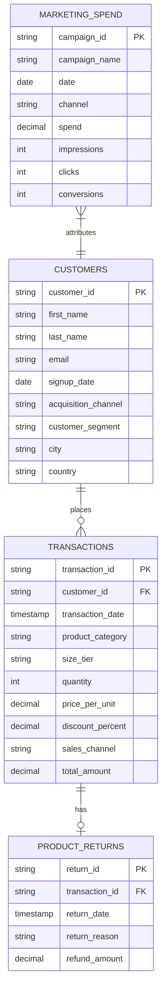

# LumaStyle Customer Lifecycle & Profitability Analytics

Welcome to the data analytics workspace for **LumaStyle**, a multi-channel retail fashion brand. This workspace hosts data engineering and analytics pipelines to study customer acquisition cost (CAC), return patterns, order lifecycles, and Customer Lifetime Value (CLV) through RFM features and unsupervised machine learning models.

---

## 📂 Project Structure

The repository is structured as follows:

```text
E COmmerce/
├── README.md                 # Project documentation and guidelines
├── sql/
│   └── 01_init_schema.sql    # PostgreSQL database initialization scripts
├── src/
│   ├── __init__.py           # Python package declaration
│   ├── generate_mock_data.py # Multi-channel synthetic retail data generator
│   ├── ingestion.py          # Data ingestion and schema validation layer
│   ├── transformation.py     # Feature engineering, RFM extraction & channel metrics
│   ├── diagnostics.py        # ML Decision Tree model for product return diagnostics
│   └── export_dashboard_data.py # BI data aggregation and export script
├── notebooks/
│   └── eda_rfm_clustering.ipynb # Jupyter notebook template for EDA and K-Means segmentation
├── docs/
│   ├── dashboard_spec.md        # Executive dashboard wireframe and KPIs
│   └── executive_brief.md       # Final strategic recommendation brief
└── data/                     # Local file data lake (Generated dynamically)
    ├── customers.csv
    ├── transactions.csv
    ├── product_returns.csv
    └── marketing_spend.csv
```

---

## 🛢️ PostgreSQL Database Schema

The database design simulates a multi-channel fashion e-commerce operation with brick-and-mortar stores.



### Table Definitions
1. **`customers`**: Profiles representing buyers, signups, and channels.
2. **`transactions`**: Order logs across categories (Apparel, Footwear, Home & Living, Accessories).
3. **`product_returns`**: Tracks items returned, reasons (e.g. size mismatch, defects), and refunds.
4. **`marketing_spend`**: Daily tracking of performance marketing details across acquisition channels.

---

## 🛠️ Technical Stack
- **Database**: PostgreSQL (Relational schema DDL found in `/sql/`).
- **Data Engineering & Analysis**: Python 3.8+, Pandas, NumPy.
- **Machine Learning**: Scikit-Learn (K-Means Clustering, StandardScaler).
- **Visualization**: Matplotlib, Seaborn, and BI integration (e.g. Power BI, Tableau).

---

## 🚀 Getting Started

### 1. Environment Setup
Clone or navigate to the workspace directory and set up a Python virtual environment:
```bash
# Create virtual environment
python -m venv venv

# Activate virtual environment (Windows PowerShell)
.\venv\Scripts\Activate.ps1

# Install required dependencies
pip install pandas numpy scikit-learn matplotlib seaborn
```

### 2. Generate Synthetic Data
Run the generator script to create raw datasets matching typical retail behaviors:
```bash
python src/generate_mock_data.py
```
This generates raw CSV files in the `/data` folder.

### 3. Run Ingestion & Data Transformation
Run the pipeline to clean the datasets and calculate customer metrics (Tenure, RFM metrics, refund rates) and acquisition details (CAC, CTR, ROI):
```bash
python -m src.transformation
```
Two analytical output files will be created in `/data`:
- `customer_metrics.csv`
- `channel_performance.csv`

### 4. Interactive Exploratory & Customer Segmentation
Launch Jupyter Notebook to perform EDA, run K-Means, and profile customer segments:
```bash
# Start Jupyter
jupyter notebook
```
Open [notebooks/eda_rfm_clustering.ipynb](file:///d:/PROGRAMMING/PROJECTS/E%20COmmerce/notebooks/eda_rfm_clustering.ipynb) to inspect or execute analysis steps.

### 5. Return Diagnostics
Run the root-cause diagnostics machine learning model to pinpoint product categories and size tiers driving high returns:
```bash
python src/diagnostics.py
```

### 6. Dashboard Export
Generate the unified BI dataset for importing into Power BI / Tableau:
```bash
python src/export_dashboard_data.py
```
This produces `data/bi_dashboard_export.csv`, ready for visualization as defined in `docs/dashboard_spec.md`.

---

## 📊 Analytics Framework Overview

### RFM Metrics
- **Recency**: Elapsed time (in days) since a customer's last purchase. Lower recency indicates higher engagement.
- **Frequency**: The total count of purchases. High frequency indicates high brand loyalty.
- **Monetary (Value)**: Total net spend (Gross orders minus refunds). Highlights the highest-value users.

### Acquisition Performance
- **CAC (Customer Acquisition Cost)**: $\frac{\text{Total Spend on Channel}}{\text{Total Signups on Channel}}$
- **CPA (Cost Per Acquisition)**: $\frac{\text{Total Spend}}{\text{Total Campaign Conversions}}$
- **CTR (Click-Through Rate %)**: $\frac{\text{Clicks}}{\text{Impressions}} \times 100$
